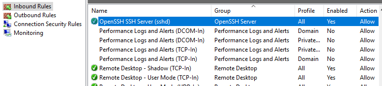
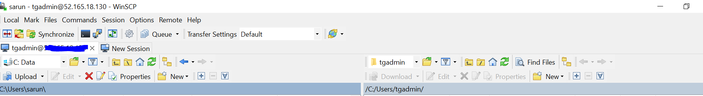
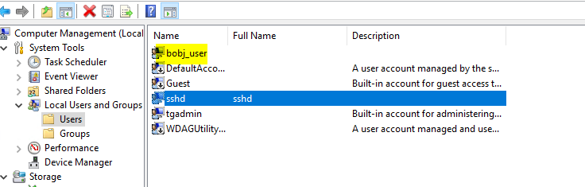

# SFTP on windows
**Pre-requisite**
We need windows 2019 server for enabling Openssh server and client features

## Step 1
Spin up a windows server 2019 in Azure

Start the Powershell as administrator and run the below command

```
Get-WindowsCapability -Online | Where-Object Name -Like 'OpenSSH*'
```


```
Add-WindowsCapability -Online -Name 'OpenSSH.Server~~~~0.0.1.0'
```
<div style="page-break-after: always;"></div>

## Step 2
check if the firewall port 22 is allowed. When you run the above command the firewall rule also added automatically



## Initial configuration
Start the ssd services
```
    Start-Service sshd
```
Set the start service type as automatic
```
Set-Service -Name sshd -StartupType 'Automatic'
```
Confirm the Firewall rule is configured
```
Get-NetFirewallRule -Name *ssh*
```

Try and access using the admin credential ones from any client machine
```
ssh <admin>@<ip or hostname>
``` 



> NOTE: if its not working check the firewall rule or NSG rule in cloud

<div style="page-break-after: always;"></div>

## set the user
User has to be local user
```
New-LocalUser -name bobj_user
```
This user can be set up with password never expiring also. 



Now we will have to give this user access to one specific folder or area when the user sftp into server
create a directory in any drive and name it properly

For demo created **c:\bobj**

<div style="page-break-after: always;"></div>

## configure the sshd_config
We now have to configure the sshd for only sftp on port 22 and allow user access to **c:\bobj** for the user we have created.

The way we do is to edit the file in the following directory **%ProgramData%\ssh\sshd_config**

To setup a sftp-only chroot server, set ForceCommand to internal-sftp and match user to direct into only **c:\bobj**

```
ForceCommand internal-sftp
Match User bobj_user
	ChrootDirectory "c:\bobj"

```
> NOTE: This configuration has to be vetted completely and how it has to be set up. Please refer to the documentation 

<div style="page-break-after: always;"></div>

## Lets create a dummy file in the folder **C:\bobj**


## Stop and start the services
```
Stop-Service sshd
Stop-Service ssh-agent

Start-Service sshd
Start-Service ssh-agent
```

<div style="page-break-after: always;"></div>

## check via any winscp or filezilla client if it works


## We can set up passwordless authentication if required.
This can also be done using the ssh-keygen to generate a pvt and public key and copy the public key in the %USERPROFILE%\.ssh\authorized_keys 

### Thanks